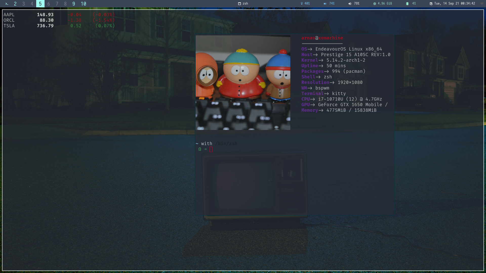

<h1 align="center">💸 Just a dumb script for getting stonks 💸<h1>
<p align="center">

</p>


#### Hopefully if you want integrate this with your polybar/systray 
### Requirements :
* jq
* watch

### To USE :

```bash
curl -o stock_price.sh https://github.com/xerexcoded/stock_price/blob/main/stock_price.sh
```

### Can Use with single and/or multiple tickers :
```bash
./stock_price.sh ORCL MSFT GOOG TSLA
```

### Also use with watch for example 10 seconds :
```bash
watch -n 10 -t -c ./stock_price.sh ORCL MSFT GOOG TSLA
```
### GHUMAO :

